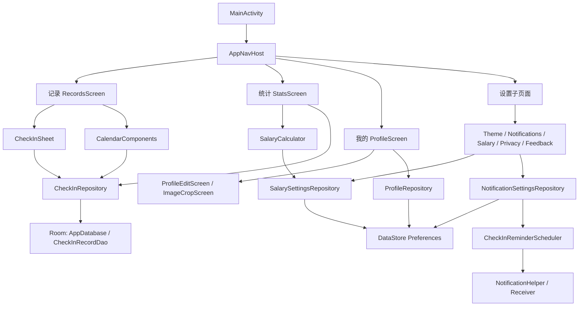

<div align="center">
  

  <h1>工时打卡</h1>

  <p>一款面向日常排班、工时记录、薪资估算与月度统计的 Android 打卡应用。</p>

  <p>
    
    
    
    
  </p>
</div>

---

## 预览

<div align="center">
  
</div>

## 功能概览

| 图标 | 模块 | 功能 |
| --- | --- | --- |
| `EventNote` | 记录 | 日历打卡、批量选择日期、记录正班/加班/周末/节假工时、清除选中日期记录 |
| `QueryStats` | 统计 | 月度工时结构、预计工资、近 7 天趋势、班次分布、请假统计 |
| `CalendarMonth` | 报表 | 月度明细、每日记录汇总、文本报表复制、CSV 导出 |
| `Payments` | 薪资 | 支持“正班 + 加班”“底薪 + 加班”“综合工作制”“小时计算”等模式 |
| `NotificationsActive` | 提醒 | 上班/下班打卡提醒、系统通知、开机后提醒恢复 |
| `Palette` | 主题 | 浅色、深色、跟随系统主题 |
| `AccountCircle` | 我的 | 昵称、头像裁剪、教程、隐私与安全、意见反馈 |

## 技术栈

| 分类 | 技术 |
| --- | --- |
| 语言 | Kotlin |
| UI | Jetpack Compose, Material 3, Material Icons Extended |
| 架构 | 单 Activity + Compose 页面状态驱动 |
| 本地数据库 | Room, KSP |
| 本地偏好 | DataStore Preferences |
| 异步 | Kotlin Coroutines / Flow |
| 构建 | Gradle 8.14.4, Android Gradle Plugin 8.7.3 |
| 兼容 | minSdk 24, targetSdk 35 |

## 架构说明



### 分层

```text
app/src/main/java/com/worktime/checkin
├── MainActivity.kt                 # 应用入口
├── data                            # Room、DataStore、Repository、薪资计算
├── ui
│   ├── navigation                  # 底部导航与设置页路由
│   ├── screen                      # 记录、统计、我的、设置、报表等 Compose 页面
│   └── theme                       # 主题、颜色、字体
└── res                             # 图标、启动页、主题、字符串资源
```

## 主要模块

### 记录

- 月历展示每日工时摘要。
- 支持单日或多日期批量打卡。
- 支持正班、加班、周末、节假、请假等记录类型。
- 支持按月进入明细报表。

### 统计

- 自动计算月度总工时、日均工时、预计工资。
- 拆分正班、加班、周末、节假工时结构。
- 展示近 7 天趋势与白班、早班、中班、晚班分布。

### 薪资

- 支持多种薪资计算方式。
- 可配置底薪、正班时薪、加班倍率、周末倍率、节假倍率。
- 小时工模式支持独立设置日常时薪与节假时薪。

### 我的

- 支持昵称与头像设置。
- 支持头像选择、裁剪与本地保存。
- 包含主题、通知、隐私、安全、教程、反馈等入口。

## 权限说明

| 权限 | 用途 |
| --- | --- |
| `INTERNET` | 获取天气、一言等网络内容 |
| `POST_NOTIFICATIONS` | Android 13+ 发送打卡提醒 |
| `RECEIVE_BOOT_COMPLETED` | 开机后恢复提醒 |
| `SCHEDULE_EXACT_ALARM` / `USE_EXACT_ALARM` | 定时打卡提醒 |
| `READ_MEDIA_IMAGES` | 选择头像图片 |
| `ACCESS_FINE_LOCATION` / `ACCESS_COARSE_LOCATION` | 获取位置相关信息 |

## 构建与运行

```bash
./gradlew assembleDebug
```

构建成功后，APK 输出路径：

```text
app/build/outputs/apk/debug/app-debug.apk
```

## 项目信息

| 项 | 值 |
| --- | --- |
| 应用名 | 工时打卡 |
| 包名 | `com.worktime.checkin` |
| 当前版本 | `2.3.1` |
| versionCode | `20301` |
| minSdk | `24` |
| targetSdk | `35` |

## 开发备注

- 数据默认保存在本地 Room 数据库与 DataStore 中。
- 历史版本中出现过中文编码异常，当前版本已清理界面硬编码乱码，并保留旧数据兼容逻辑。
- Gradle Wrapper 使用腾讯云镜像，便于国内网络环境同步。
